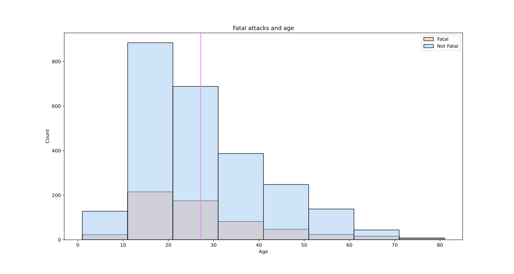
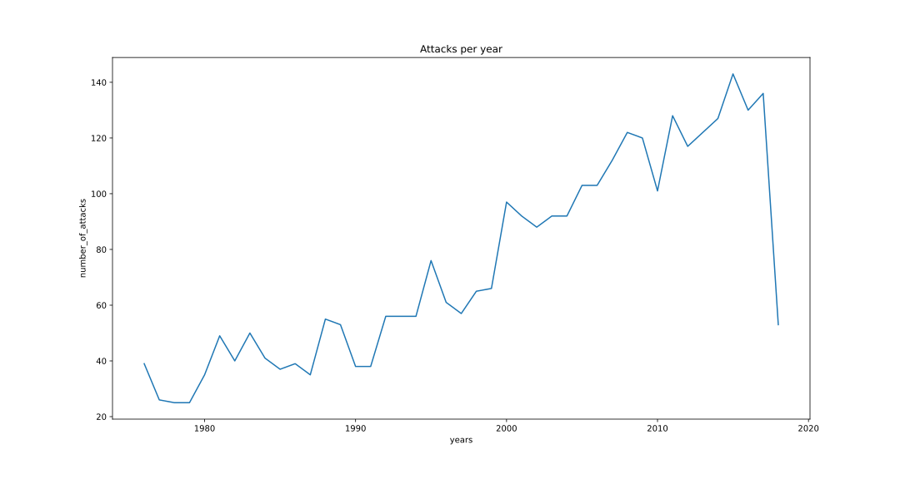
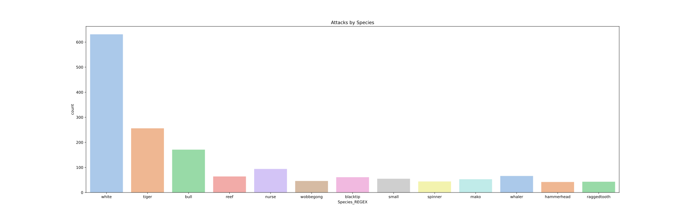

# Pandas Project

This is my first Ironhack bootcamp project and my first data analysis project with `Python`. 

We have been given a csv file with data on shark attacks. This file was kind of messy and required a thorough cleaning, wrangling and manipulation and to guide this, some hypotheses were put forward. To prove those hypotheses  some visualization tools were used. 

The following libraries are used to verify the hypotheses: `seaborn`, `pandas`, `matplotlib`, `numpy`, `re` and `math`.

## Preliminary Cleaning
The first step is to perform a preliminary cleaning to make the data more manipulable. 

## Hypothesis and Cleanliness
Then, the hypotheses are raised and the cleaning is followed by a cleaning oriented towards these hypotheses.

The hypotheses selected are:
#### The country with more attacks is Australia
#### The region with more attacks is "Latin America and the Caribbean Sea"
#### The most frequent activity is surfing
#### The older the age, the more fatal attacks
#### The trend of attacks tends to increase since 1975
#### The shark that attacks the most is the white shark

## Visualization and Story-Telling
Finally, the results are represented visually and some conclusions are drawn. 

#### The country with more attacks is not Australia, it is United States  

#### The region with more attacks is not "Latin America and the Caribbean Sea", it is Northern America

#### The most frequent activity is surfing

#### The younger, the more fatal attacks

#### The trend of attacks tends to increase since 1975

#### The shark that attacks the most is the white shark

